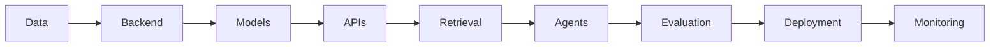

<h1 align="center">Hi 👋, I'm Dhanush J K</h1>

<h3 align="center">
Software Engineer • Backend Engineer • AI Engineer
</h3>

<p align="center">
  <b>Python • FastAPI • React • PostgreSQL • LLMs • RAG • AI Agents</b>
</p>

<p align="center">
Building scalable backend systems and production-ready AI applications that solve real-world engineering problems.
</p>

<p align="center">
  <a href="https://dhanushjk.lovable.app/">
    
  </a>
  <a href="https://www.linkedin.com/in/dhanushjk/">
    
  </a>
  <a href="mailto:jkdhanush11@gmail.com">
    
  </a>
  <a href="https://github.com/JKDhanush">
    
  </a>
</p>

<p align="center">
  
  
</p>

---

## 👨‍💻 About Me

```yaml
name: Dhanush J K
role: Software Engineer | Backend & AI Engineer
education: IIITDM Kancheepuram
focus:
  - Backend Engineering
  - Generative AI
  - AI Agents
  - Machine Learning
  - Full-Stack Development
currently_building: Production-ready AI + Backend Systems
```

I'm a **Software Engineer** focused on building scalable backend systems, full-stack applications, and production-ready AI software.

My engineering stack combines:

**⚙️ Backend Engineering** → Python, FastAPI, PostgreSQL, REST APIs, Docker  
**🤖 AI Engineering** → LLMs, RAG, AI Agents, LangChain, LangGraph  
**🧠 Machine Learning** → TensorFlow, PyTorch, Scikit-learn  
**🎨 Full Stack** → React.js, JavaScript, HTML, CSS  
**☁️ Cloud & DevOps** → AWS, GCP, Docker, Git, CI/CD  

I've worked across **The Professional Couriers, Renault Nissan Technology & Business Centre India, Tata Consultancy Services – Research & Innovation, and Grinder 2.0**.

I enjoy taking systems through the complete engineering lifecycle:

```text
Problem → Architecture → Development → Testing → Deployment → Monitoring
```

---

# 💼 Experience

<details open>
<summary><b>💻 Software Engineer — The Professional Couriers</b></summary>

<br>

**Apr 2026 – Present | Chennai, India**

- Built production backend applications using **Python, FastAPI, PostgreSQL and REST APIs** supporting **5,000+ monthly users**
- Developed shipment booking, live tracking, POD verification and logistics workflows
- Designed backend services integrating authentication, enterprise databases and AI-powered features
- Enabled real-time access across **1M+ shipment records**
- Built responsive enterprise applications using **React.js**
- Improved operational efficiency by **40%**
- Worked across testing, debugging, performance optimization, Docker deployment and Git workflows

**Stack**

`Python` `FastAPI` `PostgreSQL` `React.js` `REST APIs` `Docker` `Git` `SQL`

</details>

---

<details>
<summary><b>🚗 Software Engineer Intern — Renault Nissan Technology & Business Centre India</b></summary>

<br>

**Jan 2026 – Apr 2026 | Chennai, India**

- Developed high-performance software modules using **Python and TensorFlow**
- Processed **200+ automotive crash simulation datasets**
- Built reusable feature-engineering and model-execution pipelines
- Developed automated validation frameworks achieving **<2% prediction error** and **0.99 R²**
- Engineered a surrogate prediction system reducing execution time from approximately **8 hours → 10–20 ms**
- Work contributed toward an **ASME research publication**

**Stack**

`Python` `TensorFlow` `Pandas` `NumPy` `Machine Learning`

</details>

---

<details>
<summary><b>⚡ Software Engineer Intern — Tata Consultancy Services, Research & Innovation</b></summary>

<br>

**May 2025 – Jul 2025 | Pune, India**

- Developed neural-network-based computational systems using **Python and TensorFlow**
- Achieved **<2.5% prediction error across 70+ evaluations**
- Refactored and upgraded a **2,000+ line TensorFlow codebase**
- Automated preprocessing pipelines for **1M+ multivariate time-series records**
- Delivered approximately **250× faster inference** than traditional simulation workflows
- Collaborated with cross-functional R&D teams across testing, debugging and optimization

**Stack**

`Python` `TensorFlow` `Pandas` `PySpark` `Machine Learning` `Deep Learning`

</details>

---

<details>
<summary><b>🛠️ Software Engineer Intern — Grinder 2.0</b></summary>

<br>

**Nov 2024 – Mar 2025 | Chennai, India**

- Developed a full-stack engineering application using **React.js and Python**
- Designed backend services across **15,000+ operational data points**
- Built reusable React components and engineering visualization interfaces
- Integrated ML models with backend services
- Reduced batter preparation time by **30%**

**Stack**

`Python` `React.js` `REST APIs` `Scikit-learn` `SQL` `HTML` `CSS`

</details>

---

# 🚀 Featured Projects

<table>
<tr>
<td width="50%" valign="top">

### 🤖 Generative AI App Generator

AI-powered software engineering agent capable of processing project requirements and generating application components through an agentic workflow.

**Tech**

`Python` `Generative AI` `AI Agents` `LLMs`

<a href="https://github.com/JKDhanush/Automatic-App-Generator_Generative-AI">
  
</a>

</td>

<td width="50%" valign="top">

### 📅 AI Appointment Scheduler

AI-powered appointment scheduling system that transforms natural-language text and uploaded images into structured appointment information.

**Tech**

`FastAPI` `Python` `OCR` `NLP` `REST API`

<a href="https://github.com/JKDhanush/Appointment-Scheduling-System_OCR">
  
</a>

</td>
</tr>

<tr>
<td width="50%" valign="top">

### 🧠 Sarcasm Detection NLP

End-to-end NLP application for detecting sarcastic and non-sarcastic text with an interactive prediction interface.

**Tech**

`Python` `NLP` `Machine Learning` `Scikit-learn` `Gradio`

<a href="https://github.com/JKDhanush/Sarcasm-Detection_NLP">
  
</a>

</td>

<td width="50%" valign="top">

### 🔬 AI / ML Engineering Projects

Projects spanning **LLMs, RAG, AI Agents, Computer Vision, NLP, Deep Learning, Data Engineering and predictive systems**.

<br>

<a href="https://github.com/JKDhanush?tab=repositories">
  
</a>

</td>
</tr>
</table>

---

# 🧠 Tech Stack

### 💻 Languages

<p>

</p>

`Python` • `JavaScript` • `SQL` • `C`

### ⚙️ Backend & Databases

<p>

</p>

`FastAPI` • `REST APIs` • `PostgreSQL` • `MongoDB` • `Authentication` • `Microservices`

### 🎨 Frontend

<p>

</p>

`React.js` • `HTML` • `CSS` • `Tailwind CSS`

### 🤖 Generative AI

<p>


</p>

`LLMs` • `RAG` • `AI Agents` • `LangChain` • `LangGraph` • `Prompt Engineering` • `Fine-Tuning` • `QLoRA` • `Hugging Face`

### 🧠 Machine Learning

<p>

</p>

`TensorFlow` • `PyTorch` • `Scikit-learn` • `Deep Learning` • `NLP` • `Computer Vision`

### ☁️ Cloud & DevOps

<p>

</p>

`AWS` • `GCP` • `Docker` • `Git` • `GitHub` • `CI/CD` • `MLflow`

---

# 🌐 Open Source

<details>
<summary><b>📈 Kalshi GenAI Trading Bot</b></summary>

<br>

Contributed enhancements enabling the GenAI trading agent to recommend both **YES and NO positions**, extending its structured decision output with trading-side information and reasoning.

</details>

<details>
<summary><b>🧠 Sentiment Analysis Framework</b></summary>

<br>

Contributed improvements involving:

- Modular software architecture
- Unit testing
- Input validation
- Error handling
- Documentation
- Production-oriented development practices

</details>

---

# ⚡ What I'm Exploring

<table>
<tr>
<td>

🧠 **Backend & System Design**

🤖 **Production Agentic AI**

🔗 **LangGraph & Multi-Agent Systems**

📚 **Advanced RAG Architectures**

</td>
<td>

🧬 **LLM Fine-Tuning & QLoRA**

📊 **LLM Evaluation & Observability**

🌐 **Distributed Backend Systems**

🔌 **MCP & Agent Infrastructure**

</td>
</tr>
</table>

---

# 💡 How I Think About AI Engineering

I don't view AI as an isolated model.

I focus on the **complete production system surrounding the model**:



My goal is to combine **strong software engineering with intelligent AI systems** to automate workflows, augment decision-making and solve meaningful real-world problems.

---

# 🎓 Education

<table>
<tr>
<td>

### 🏫 Indian Institute of Information Technology Design & Manufacturing Kancheepuram

**Bachelor of Technology (B.Tech) — Mechanical Engineering**

📅 **2022 – 2026**

🎓 **CGPA: 9.1 / 10**

My engineering background has enabled me to work across the intersection of **software engineering, AI, machine learning, simulation and optimization**.

</td>
</tr>
</table>

---

# 🏆 Certifications

<p>


</p>

<p>


</p>

---

# 📈 GitHub Analytics

<p align="center">
  
  
</p>

<p align="center">
  
</p>

---

# 🧩 Engineering Toolkit

<p align="center">


</p>

<p align="center">


</p>

---

# 🤝 Let's Connect

<p align="center">

<a href="https://www.linkedin.com/in/dhanushjk/">
  
</a>

<a href="https://github.com/JKDhanush">
  
</a>

<a href="https://dhanushjk.lovable.app/">
  
</a>

<a href="mailto:jkdhanush11@gmail.com">
  
</a>

</p>

---

<h3 align="center">
Software Engineering × Backend Systems × Artificial Intelligence
</h3>

<p align="center">
<i>Building scalable software and intelligent systems that solve real-world problems.</i>
</p>

<p align="center">
⭐ <b>Explore my repositories to see what I'm building.</b>
</p>
