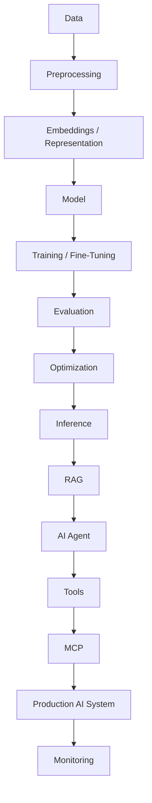

<h1 align="center">Hi 👋, I'm Dhanush J K</h1>

<h3 align="center">
🤖 AI Engineer • 🧠 LLM Engineer • 🔬 Deep Learning
</h3>

<p align="center">
  <b>Deep Learning • Transformers • LLMs • RAG • AI Agents • MCP • AI Systems</b>
</p>

<p align="center">
  Building, understanding and deploying intelligent systems — from neural networks and transformers to production AI agents.
</p>

<p align="center">
  <!-- <a href="https://dhanushjk.lovable.app/">
    
  </a> -->

  <a href="https://www.linkedin.com/in/dhanushjk/">
    
  </a>
  <a href="mailto:jkdhanush11@gmail.com">
    
  </a>
  <a href="https://github.com/JKDhanush">
    
  </a>
</p>

<p align="center">
  
  
</p>

---

## 🧠 Who I Am

```yaml
name: Dhanush J K
role: AI Engineer

focus:
  - Deep Learning
  - Transformers
  - Large Language Models
  - Generative AI
  - RAG
  - AI Agents
  - Model Fine-Tuning
  - MCP
  - AI Systems

interests:
  - How neural networks learn
  - How transformers understand sequences
  - How LLMs are trained and fine-tuned
  - How AI agents use tools
  - How intelligent systems are evaluated
  - How AI models are optimized for production

philosophy:
  "Don't just use AI. Understand how it works."
```

I'm an **AI Engineer focused on building intelligent systems and understanding the technologies underneath modern AI**.

My interests span the entire AI stack:

```text
Deep Learning
      ↓
Neural Networks
      ↓
Transformers
      ↓
Large Language Models
      ↓
Fine-Tuning & Alignment
      ↓
RAG & Retrieval
      ↓
AI Agents
      ↓
MCP & Tool Use
      ↓
Production AI Systems
```

I enjoy going beyond API calls and abstractions — understanding the **architecture, mathematics, training process, inference behaviour and engineering trade-offs** behind AI systems.

---

# 🔬 What I Work On

<table>
<tr>

<td width="50%" valign="top">

### 🧠 Machine Learning

* Supervised Learning
* Unsupervised Learning
* Regression
* Classification
* Feature Engineering
* Model Evaluation
* Optimization
* Time-Series Modeling

</td>

<td width="50%" valign="top">

### 🔥 Deep Learning

* Neural Networks
* Backpropagation
* Gradient Descent
* CNNs
* RNNs
* LSTMs
* Representation Learning
* Model Optimization

</td>

</tr>

<tr>

<td width="50%" valign="top">

### 🔄 Transformers

* Attention
* Self-Attention
* Multi-Head Attention
* Positional Encoding
* Tokenization
* BPE
* Encoder / Decoder
* Transformer Architecture

</td>

<td width="50%" valign="top">

### 🤖 LLM Engineering

* Large Language Models
* Fine-Tuning
* Instruction Tuning
* LoRA
* QLoRA
* Quantization
* Inference
* Evaluation

</td>

</tr>

<tr>

<td width="50%" valign="top">

### 🔍 Generative AI

* RAG
* Embeddings
* Vector Search
* Semantic Search
* Chunking
* Retrieval
* Reranking
* Context Engineering

</td>

<td width="50%" valign="top">

### 🧩 Agentic AI

* AI Agents
* Tool Calling
* Function Calling
* Planning
* Memory
* Agent Workflows
* Multi-Agent Systems
* LangGraph

</td>

</tr>

<tr>

<td width="50%" valign="top">

### 🔌 MCP

* Model Context Protocol
* MCP Servers
* MCP Clients
* Tools
* Resources
* Context
* Agent Infrastructure

</td>

<td width="50%" valign="top">

### ⚡ AI Systems

* Model Serving
* Inference Optimization
* Quantization
* Evaluation
* Observability
* Deployment
* Monitoring
* MLOps

</td>

</tr>
</table>

---

# 💼 Experience

<!-- <details open>

<summary><b>🤖 AI Engineer — The Professional Couriers</b></summary>

<br>

**Apr 2026 – Present | Chennai, India**

* Developed production AI applications using **Python, LLMs, RAG and AI Agents**
* Built LLM-powered customer support applications supporting **5,000+ monthly shipment queries**
* Engineered AI agents integrating **enterprise databases, vector databases and backend APIs**
* Enabled conversational analytics across **1M+ shipment records**
* Developed AI-powered workflows for real-world logistics operations
* Reduced customer support workload by approximately **40%**
* Reduced manual reporting effort by approximately **35%**
* Worked across AI development, backend engineering, deployment and optimization

**Stack**

`Python` `LLMs` `RAG` `AI Agents` `FastAPI` `Vector Databases` `SQL` `Docker`

</details> -->

---

<details>

<summary><b>AI Research Intern — Renault Nissan Technology & Business Centre India</b></summary>

<br>

**Sep 2026 – Present | Chennai, India**

**Stack**

`Python` `Pytorch` `TensorFlow` `Pandas` `NumPy` `Machine Learning` `Deep Learning`

</details>

---

<details>

<summary><b>AI Research Intern — TCS Research & Innovation</b></summary>

<br>

**May 2025 – Jul 2025 | Pune, India**

**Stack**

`Python` `TensorFlow` `Deep Learning` `Machine Learning` `Pandas` `PySpark`

</details>

# 🚀 Featured Projects

<table>
<tr>

<td width="50%" valign="top">

### 🔄 Transformer From Scratch

Implementation-focused project exploring the internal mechanics of Transformer architectures.

**Exploring**

`Tokenization` `BPE`  
`Embeddings` `Positional Encoding`  
`Self-Attention` `Multi-Head Attention`  
`Transformer Blocks`

</td>

<td width="50%" valign="top">

### 🤖 Generative AI App Generator

AI-powered software engineering agent capable of processing project requirements and generating application components through an agentic workflow.

**Tech**

`Python` `LLMs`  
`Generative AI` `AI Agents`  
`Agentic Workflows`

</td>

</tr>

<tr>

<td width="50%" valign="top">

### 🔍 RAG Knowledge Systems

Retrieval-augmented AI systems focused on grounding language models using external knowledge.

**Tech**

`Embeddings` `FAISS`  
`Vector Search` `RAG`  
`LLMs` `Retrieval`

</td>

<td width="50%" valign="top">

### 🧩 AI Agent Systems

Experiments with AI agents capable of executing workflows and interacting with external tools.

**Concepts**

`Tool Calling` `Function Calling`  
`Planning` `Memory`  
`Agent Workflows` `Multi-Agent Systems`

</td>

</tr>

<tr>

<td width="50%" valign="top">

### 🧬 Fine-Tuned Logistics Assistant

LLM-based logistics assistant exploring parameter-efficient fine-tuning and retrieval-augmented generation.

**Tech**

`Llama 3` `Hugging Face`  
`QLoRA` `LangChain`  
`RAG` `Fine-Tuning`

</td>

<td width="50%" valign="top">

### 🔌 MCP AI Systems

Exploring Model Context Protocol for connecting AI models and agents with external tools and resources.

**Concepts**

`MCP` `Tools`  
`Resources` `Context`  
`AI Agents` `Agent Infrastructure`

</td>

</tr>

</table>

---


# 🧪 AI From Scratch

I believe that **implementing concepts from scratch is one of the best ways to understand AI**.

```text
Neural Network
      │
      ├── Forward Pass
      ├── Loss
      ├── Backpropagation
      └── Gradient Descent
              ↓
        Deep Learning
              ↓
       Sequence Models
              ↓
        Transformers
              │
              ├── Tokenization
              ├── Embeddings
              ├── Attention
              ├── Multi-Head Attention
              └── Positional Encoding
                      ↓
                    LLMs
                      │
              ├── Fine-Tuning
              ├── QLoRA
              ├── Quantization
              └── Inference
                      ↓
                AI Applications
                      │
              ├── RAG
              ├── Agents
              └── MCP
```

---

# 🧠 How I Think About AI

I don't want AI to be a black box.

I want to understand:

```text
Why does the model learn?
        ↓
How does the architecture represent information?
        ↓
How does attention work?
        ↓
How are tokens represented?
        ↓
How does training change the parameters?
        ↓
How does fine-tuning change behaviour?
        ↓
How does inference work?
        ↓
How can the model be evaluated?
        ↓
How can it be optimized?
        ↓
How can it interact with the real world?
```

My goal is to move from:

> **Using AI**

to:

> **Understanding AI**

to:

> **Engineering AI**

---

# ⚡ Current Exploration

<table>

<tr>

<td width="50%">

### 🧠 Deep Learning

* Advanced neural networks
* Optimization
* Representation learning
* Efficient training
* Model architectures

</td>

<td width="50%">

### 🔄 Transformers

* Attention mechanisms
* Transformer internals
* Tokenization
* Language modeling
* Efficient architectures

</td>

</tr>

<tr>

<td width="50%">

### 🤖 LLM Engineering

* Fine-tuning
* QLoRA
* Quantization
* Inference
* Evaluation

</td>

<td width="50%">

### 🧩 Agentic AI

* Tool use
* Planning
* Memory
* Agent workflows
* Multi-agent systems

</td>

</tr>

<tr>

<td width="50%">

### 🔌 MCP

* MCP servers
* MCP clients
* Tools
* Resources
* Agent infrastructure

</td>

<td width="50%">

### 📊 AI Evaluation

* LLM evaluation
* RAG evaluation
* Agent evaluation
* Observability
* Reliability

</td>

</tr>

</table>

---

# 🧬 AI Engineering Stack

### 🐍 Languages

<p>


</p>

`Python` • `C` • `JavaScript` • `SQL`

---

### 🔥 Deep Learning

<p>


</p>

`PyTorch` • `TensorFlow` • `Keras`

`Neural Networks` • `CNNs` • `RNNs` • `LSTMs`

---

### 🔄 Transformers & LLMs

<p>


</p>

`Transformers` • `Attention` • `Self-Attention`

`Tokenization` • `BPE` • `Fine-Tuning`

`LoRA` • `QLoRA` • `Quantization`

---

### 🤖 Generative AI

<p>


</p>

`LLMs` • `RAG` • `Embeddings` • `Vector Search`

`Context Engineering` • `Tool Calling`

`AI Agents` • `LangChain` • `LangGraph`

`MCP` • `Function Calling`

---

### ⚡ AI Systems

`Model Serving`

`Inference Optimization`

`Quantization`

`Evaluation`

`Observability`

`Docker`

`AWS`

`GCP`

---

# 🏗️ AI System Architecture



---

# 🎓 Education

<table>

<tr>

<td>

### 🏫 Indian Institute of Information Technology D&M Chennai
**Bachelor of Technology**

**2022 – 2026**

🎓 **CGPA: 9.05 / 10**

Engineering background with experience across **machine learning, deep learning, AI systems, simulation and optimization**.

</td>

</tr>

</table>

---

# 📈 GitHub Analytics

<p align="center">


</p>

<p align="center">


</p>

---

# 🤝 Let's Connect

<p align="center">

<a href="https://www.linkedin.com/in/dhanushjk/">

</a>

<a href="https://github.com/JKDhanush">

</a>

<!-- <a href="https://dhanushjk.lovable.app/">

</a> -->

<a href="mailto:jkdhanush11@gmail.com">

</a>

</p>

---

<h3 align="center">
🤖 AI Engineering × 🧠 Deep Learning × 🔄 Transformers × LLMs
</h3>

<p align="center">
<i>Understanding AI from the fundamentals to intelligent production systems.</i>
</p>

<p align="center">
⭐ <b>Explore my repositories — I build what I learn.</b>
</p>
